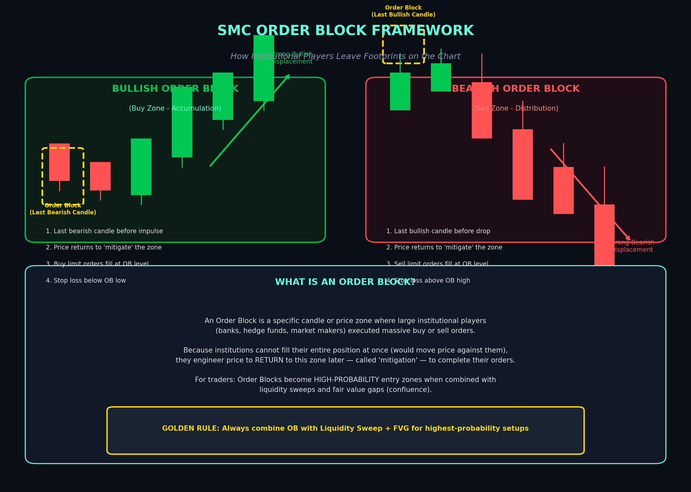
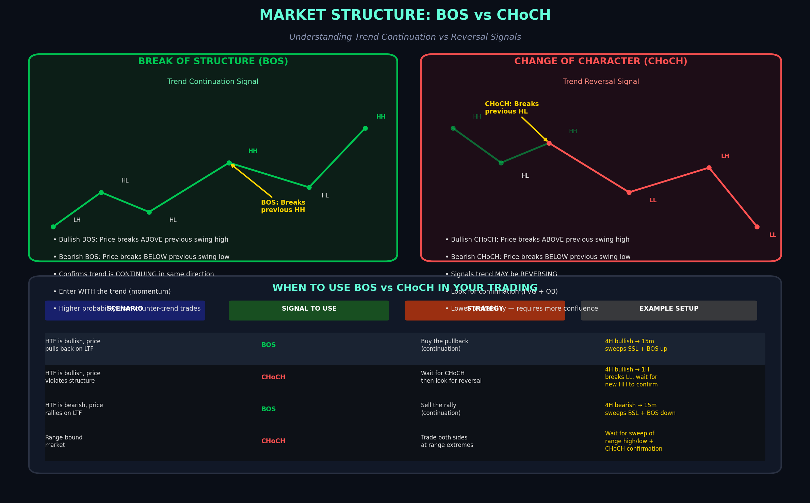
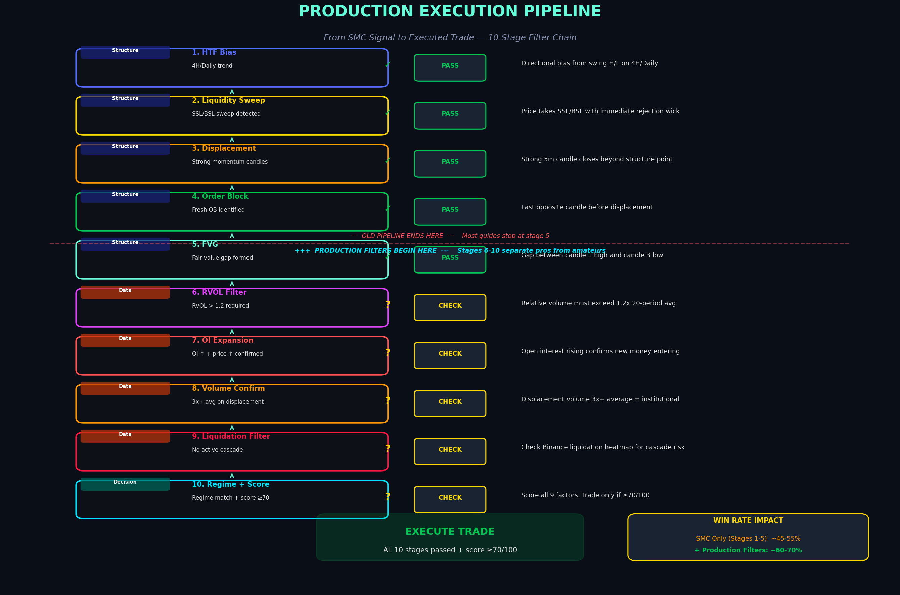
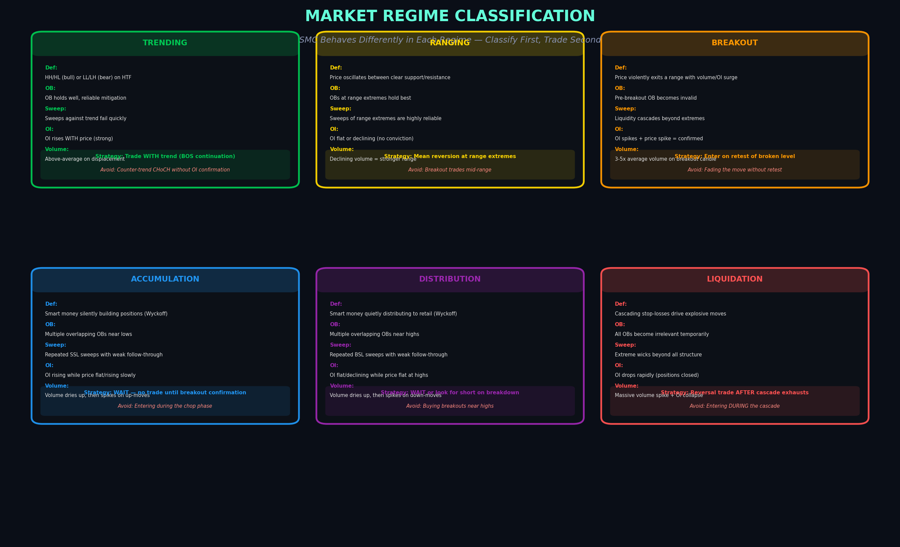
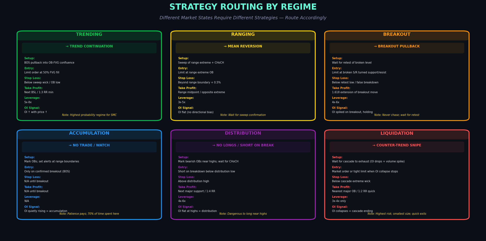
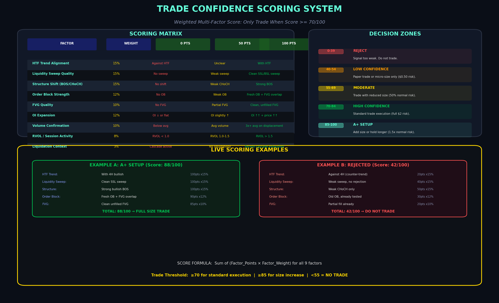
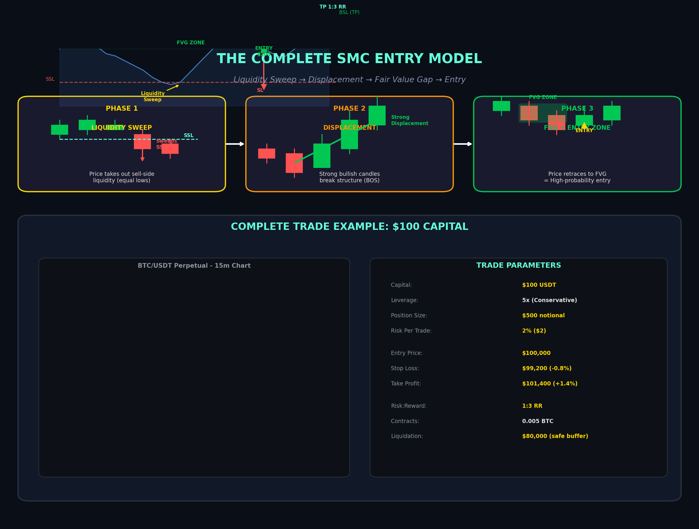
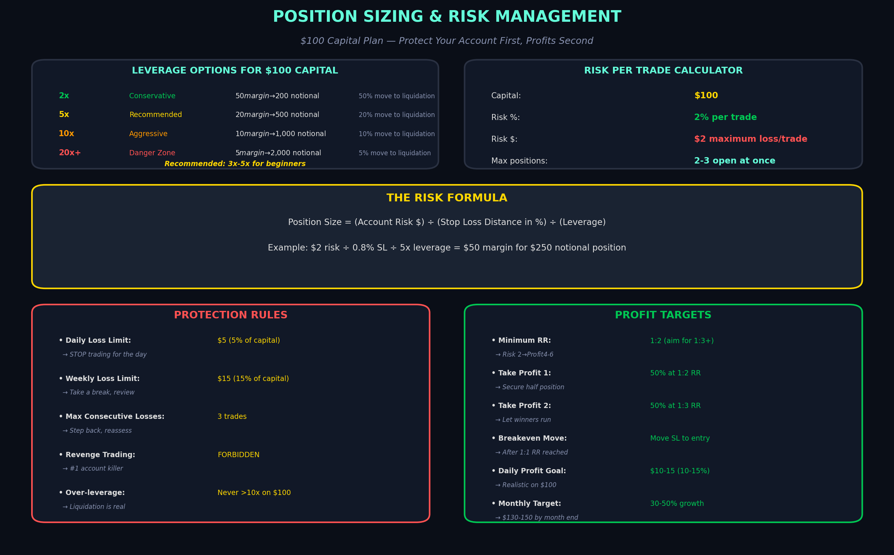

# The Complete SMC Crypto Futures Trading Guide — Production Edition

## Intraday & Swing Strategies for $100 Capital on Binance / CoinDCX

---

> **TL;DR:** Smart Money Concepts provide the structural skeleton for high-probability trades, but structure alone is not enough. This production-grade guide adds Open Interest (OI), volume, liquidation data, market regime classification, dynamic session filtering, and a weighted confidence scoring system. The result: a **10-stage execution pipeline** that filters weak signals before they cost you money. With $100 capital, use **3x-5x leverage**, risk **2% ($2) per trade**, and only execute when your composite score is **≥70/100**.

---

## 1. Understanding Smart Money Concepts (SMC)

### 1.1 What Is SMC and Why It Matters for Crypto

Smart Money Concepts (SMC) is a price-action trading framework built on one core premise: **large institutional players — banks, hedge funds, market makers, and crypto whales — drive price movement**, and their activity leaves identifiable footprints on the chart.  [(Source)](https://myfundedcapital.com/smart-money-concepts/)  Unlike retail traders who often react emotionally to price, institutions execute with scale, precision, and a need for liquidity that shapes how markets move. Understanding this dynamic gives you a structural edge because you are no longer guessing where price might go; you are anticipating where institutions are likely to engineer moves to fill their orders.

The framework's power in crypto futures is amplified by the market's unique characteristics. Cryptocurrency markets operate **24/7**, exhibit high volatility, and are heavily influenced by whale movements and exchange-based liquidity clusters.  [(Source)](https://www.altrady.com/blog/crypto-trading-strategies/smc-trading-strategy)  On Binance and CoinDCX, where perpetual futures allow leveraged long and short positions, SMC concepts translate well because the same institutional behaviors — stop hunting, liquidity engineering, and accumulation through engineered retracements — occur across BTC, ETH, and altcoin perpetual contracts.

SMC differs fundamentally from indicator-based trading. Indicators like RSI, MACD, or moving averages are **lagging derivatives of price** — they tell you what already happened. SMC focuses on what price is doing *right now* in terms of structure, liquidity, and institutional intent.  [(Source)](https://dailypriceaction.com/blog/smc-trading-strategy/)  However — and this is a critical distinction — SMC structure alone is **not a sufficient trading system**. Retail implementations of SMC massively over-detect order blocks and fair value gaps, producing signals that look perfect on a chart but fail in live markets because they ignore the forces that *validate* whether an institutional move is actually occurring.

---

### 1.2 The Three Pillars of SMC (Structure Layer)

Every SMC trade begins with three structural pillars. These form **Stages 1-5** of the production pipeline. Missing any of these means you do not have a valid setup to begin with. But passing all five only gets you to the starting line — the real edge comes from Stages 6-10.

| Pillar | Definition | What It Tells You | Visual Signal | Pipeline Stage |
|---|---|---|---|---|
| **Market Structure** | The directional "map" of price — swing highs and lows  [(Source)](https://myfundedcapital.com/smart-money-concepts/)  | Bullish, bearish, or ranging bias | HH/HL = bullish; LL/LH = bearish | Stage 1: HTF Bias |
| **Liquidity** | Pools of stops and pending orders that act as price magnets  [(Source)](https://myfundedcapital.com/smart-money-concepts/)  | Where institutions engineer moves | Equal highs/lows, swing extremes | Stage 2: Sweep |
| **Order Blocks** | Specific zones showing where institutions placed large orders  [(Source)](https://myfundedcapital.com/smart-money-concepts/)  | Where price returns for mitigation | Last opposite-color candle before impulse | Stage 4: OB |

The sequence matters: structure establishes bias, liquidity provides the trigger zone, and order blocks provide the entry precision. But the most common failure mode among retail SMC traders is stopping here — identifying an OB, seeing an FVG, and entering immediately. The next five stages are what separate discretionary chart readers from profitable traders.

---

### 1.3 Order Blocks: The Foundation with a Critical Caveat

An order block represents a specific candle or tight price zone where institutional players executed massive buy or sell orders. The theory is that price will often return to this zone — called **"mitigation"** — to allow institutions to complete unfinished orders.  [(Source)](https://www.tradingview.com/script/QMvHkvdQ-SMC-Pro-BTC-ICT-Order-Blocks-FVG-DOE/)  A bullish OB is the last bearish candle before a powerful upward move; a bearish OB is the last bullish candle before a sharp drop.

**The critical caveat:** standalone order blocks are weak signals. In live crypto markets, OBs form constantly — many are never revisited, and even more fail to hold when price returns. What transforms an OB from a decorative chart marking into a tradeable zone is **confluence with liquidity sweeps, displacement, volume expansion, and OI expansion**.  [(Source)](https://myfundedcapital.com/smart-money-concepts/)  An OB that forms after a clean liquidity sweep, with displacement candles showing 3x average volume and rising open interest, has exponentially higher probability than an OB that simply appeared during quiet, low-volume chop.

The strongest order blocks share three characteristics: they form after a **significant liquidity sweep** (not just a random wick), they are overlapped by a **fresh fair value gap**, and they appear during a period of **volume and OI expansion** that confirms institutional participation.  [(Source)](https://acy.com/en/market-news/education/confirmation-model-ob-fvg-liquidity-sweep-j-o-20251112-094218/)  For a $100 account, entering at an OB without these confirmations is gambling with slightly better odds than a coin flip. Entering at an OB with all three confirmations is a calculated risk with a defined edge.

---

## 2. Core SMC Price Action Patterns

### 2.1 Liquidity Sweeps: The Engine That Drives Price

Liquidity sweeps are the mechanism by which institutions acquire the orders they need to fill their positions. A sweep occurs when price rapidly moves beyond a visible technical level — equal highs, equal lows, previous day highs/lows, or obvious support/resistance — to trigger retail stop-loss orders and pending entries.  [(Source)](https://www.youtube.com/shorts/XjCCcEZa-Sg)  Once collected, price reverses sharply in the intended direction. This is why retail traders consistently experience their stops being hit just before price moves in their originally anticipated direction.

**Buy-side liquidity (BSL)** rests above equal highs, previous highs, and resistance levels. **Sell-side liquidity (SSL)** rests below equal lows, previous lows, and support levels. In an uptrend, price frequently sweeps SSL below a swing low to collect sell-stop orders before continuing higher. In a downtrend, price sweeps BSL above a swing high to collect buy-stop orders before dropping.  [(Source)](https://www.youtube.com/shorts/XjCCcEZa-Sg)  The key insight is that these sweeps are **engineered, not random** — they are predictable events that create the highest-probability entry opportunities when combined with displacement and OI confirmation.

| Liquidity Type | Location | What Happens When Swept | Your Action | OI Context |
|---|---|---|---|---|
| **Buy-Side (BSL)** | Above equal highs, previous highs  [(Source)](https://www.youtube.com/shorts/XjCCcEZa-Sg)  | Retail breakout buyers enter, sell stops trigger | Wait for bearish reversal | OI flat = false breakout likely |
| **Sell-Side (SSL)** | Below equal lows, previous lows  [(Source)](https://www.youtube.com/shorts/XjCCcEZa-Sg)  | Retail panic sellers exit, buy stops trigger | Wait for bullish reversal | OI rising = genuine sweep |
| **Equal Highs/Lows** | Multiple touches at same level | Accumulated stops create explosive moves | Mark these on HTF first | OI buildup near level = explosive potential |

---

### 2.2 Fair Value Gaps: The Institutional Imbalance

A fair value gap (FVG) is a three-candle pattern revealing an **imbalance in the order book** — a zone where price moved so aggressively that buyers and sellers could not be matched efficiently.  [(Source)](https://phemex.com/academy/fair-value-gap-crypto-trading)  The gap forms between the high of the first candle and the low of the third candle (bullish FVG) or between the low of the first and high of the third (bearish FVG). This inefficiency represents unfilled institutional intent.

FVGs serve two critical functions. First, they act as **high-probability entry zones** when price retraces after a liquidity sweep. Second, they provide a **natural invalidation point** — if price fills the FVG and continues beyond it, your trade thesis is wrong.  [(Source)](https://phemex.com/academy/fair-value-gap-crypto-trading)  For a trader on Binance with $100, this precision allows exact entry and stop-loss placement before taking any risk.

Approximately **30-40% of FVGs never fully fill** because the trend exhausts before retracing.  [(Source)](https://phemex.com/academy/fair-value-gap-crypto-trading)  This is why FVGs alone are not trade signals. They must be combined with a liquidity sweep, order block confluence, structural confirmation (BOS or CHoCH), and — critically — volume and OI expansion to create a complete setup. Traders who treat every FVG as a guaranteed fill have impressive screenshots but equity curves that tell a different story.

---

### 2.3 Break of Structure (BOS) vs Change of Character (CHoCH)

Market structure shifts confirm whether a potential setup represents trend continuation or reversal. **Break of Structure (BOS)** indicates continuation; **Change of Character (CHoCH)** signals potential reversal.  [(Source)](https://myfundedcapital.com/smart-money-concepts/)  Understanding this distinction is essential because they dictate entirely different trading approaches.

A **bullish BOS** occurs when price breaks above the previous swing high in an established uptrend, confirming buyers remain in control. A **bearish BOS** occurs when price breaks below the previous swing low in a downtrend. These are the highest-probability setups because you trade with the prevailing trend, and institutional flow supports your position.  [(Source)](https://nordfx.com/traders-guide/smc-trading-strategy)  For intraday trading with $100, BOS setups on the 15-minute chart after a 1-hour liquidity sweep offer the best risk-reward ratios — **provided** OI and volume confirm the move.

A **CHoCH** is more nuanced. A bullish CHoCH occurs when price breaks above a previous swing high after making lower highs and lower lows — suggesting the downtrend may be ending. CHoCH setups require **additional confluence** from order blocks, FVGs, and higher-timeframe structure shifts before entry.  [(Source)](https://myfundedcapital.com/smart-money-concepts/)  Most importantly, a CHoCH without OI expansion is frequently a **bull trap** — price breaks structure, retail buyers pile in, and then institutions sell into the buying, driving price lower. Always require OI confirmation before trusting a CHoCH signal.

| Signal | Direction | Meaning | Probability with OI | Probability without OI |
|---|---|---|---|---|
| **Bullish BOS** | Continuation | Uptrend continues; buy pullbacks | High (~65%) | Medium (~50%) |
| **Bearish BOS** | Continuation | Downtrend continues; sell rallies | High (~65%) | Medium (~50%) |
| **Bullish CHoCH** | Reversal | Potential bottom | Medium (~45%) | Low (~30%) |
| **Bearish CHoCH** | Reversal | Potential top | Medium (~45%) | Low (~30%) |

---

## 3. The Production Execution Pipeline

### 3.1 The Critical Gap: Why SMC Alone Fails in Live Markets

The original guide ended at the SMC structure layer — HTF bias, sweep, displacement, OB, FVG. Most retail SMC education stops here. This is why most retail SMC traders are unprofitable: **they trade structure without validating whether the structure represents genuine institutional intent or just noise**.  [(Source)](https://myfundedcapital.com/smart-money-concepts/)  The five additional stages in the production pipeline filter out the noise and confirm whether the setup has institutional backing.

The reality of crypto futures is that price action alone cannot distinguish between a genuine institutional accumulation move and a whale briefly pushing price to trigger retail stops before reversing. Both produce identical SMC charts — clean sweeps, strong displacement, visible FVGs. The difference is revealed in **Open Interest, volume, liquidation flow, and market regime context**.

The pipeline is designed as a **sequential filter chain**. Each stage must pass before the next is evaluated. If any stage fails, the trade is rejected — no exceptions, no "this one looks good enough." With $100 capital, you cannot afford to take borderline trades. The pipeline ensures that only the highest-conviction setups reach your account.

---

### 3.2 Stages 1-5: The SMC Structure Layer

**Stage 1 — HTF Bias (4H/Daily):** Establish directional bias by marking swing highs and lows on the 4-hour or daily chart. If the structure shows higher highs and higher lows, your bias is bullish. Only look for long setups on lower timeframes. This single filter eliminates approximately 50% of potential losing trades.

**Stage 2 — Liquidity Sweep:** Identify the nearest SSL (for longs) or BSL (for shorts) on the 1-hour chart. Wait for price to actually violate the level with a wick and immediate rejection. The sweep should be visible as a brief spike beyond the level followed by a strong reversal candle closing back within the prior range.  [(Source)](https://www.youtube.com/shorts/XjCCcEZa-Sg)

**Stage 3 — Displacement:** After the sweep, price must explode in the intended direction with strong momentum candles. The displacement should create a visible BOS or CHoCH on the 15-minute chart. Displacement candles should be significantly larger than preceding candles with minimal wicks in the direction of the move.

**Stage 4 — Order Block:** Mark the last opposite-color candle before the displacement as your order block. The OB should be "fresh" — not previously tested or mitigated. A previously tested OB has already been used by institutions and has significantly lower probability of producing another move.  [(Source)](https://www.tradingview.com/script/QMvHkvdQ-SMC-Pro-BTC-ICT-Order-Blocks-FVG-DOE/)

**Stage 5 — FVG Formation:** The displacement should leave behind a clear fair value gap between the high of the first candle and the low of the third candle (bullish) or the low of the first and high of the third (bearish). The FVG should overlap with the order block zone for maximum confluence.

---

### 3.3 Stage 6: RVOL Filter — Trade the Activity, Not the Clock

The original guide hardcoded trading sessions: London open at 2:30 PM IST, New York open at 7:00 PM IST. This is useful for beginners but dangerously rigid for production trading. **Some Asia sessions outperform New York. Some New York sessions are dead.**  [(Source)](https://medium.com/@clydejnr7/smc-trading-the-liquidity-sweep-fvg-reclaim-model-todays-setup-guide-7f4251049ffb)  The solution is dynamic session filtering using **Relative Volume (RVOL)**.

RVOL measures current volume against the average volume for the same period over the past 20 days. An RVOL above **1.2** indicates above-average institutional activity regardless of the clock time. An RVOL below **0.8** indicates a dead session where even the best SMC setups have low follow-through probability.

| RVOL Level | Interpretation | Action |
|---|---|---|
| **RVOL > 1.5** | High activity; strong institutional participation | Full-size trades allowed; best setups execute here |
| **RVOL 1.2-1.5** | Above-average activity; good for standard trades | Standard execution with normal risk |
| **RVOL 1.0-1.2** | Average activity; setups have moderate follow-through | Reduce position size by 50% |
| **RVOL 0.8-1.0** | Below-average; weak follow-through likely | Only take A+ setups (score ≥85); otherwise skip |
| **RVOL < 0.8** | Dead session; avoid trading | No trades regardless of setup quality |

For the $100 account trader, calculate RVOL on the 15-minute chart by comparing the sum of the last 4 candles' volume to the average sum of the same 4-candle period over the past 20 trading days. If RVOL is below 1.0, step away from the charts — the market is not moving with institutional conviction, and your edge is diminished.

---

### 3.4 Stage 7: Open Interest (OI) Expansion Filter

Open Interest is the **single most underutilized confirmation tool** in retail SMC trading. OI represents the total number of outstanding derivative contracts that have not been settled. For crypto futures, OI data is available in real-time on Binance through the openInterest endpoint and through CoinDCX's market data feeds.

The OI-price relationship reveals institutional intent that price action alone cannot show:

| Price Action | OI Action | Interpretation | Trade Implication |
|---|---|---|---|
| **Price ↑** | **OI ↑** | New longs opening = genuine buying | **Strong bullish** — trade with confidence |
| **Price ↑** | **OI ↓** | Shorts covering = weak rally | **Weak bullish** — rally may reverse soon |
| **Price ↓** | **OI ↑** | New shorts opening = genuine selling | **Strong bearish** — trend likely continues |
| **Price ↓** | **OI ↓** | Longs closing/covering = weak drop | **Weak bearish** — bounce possible |

A setup where price sweeps SSL, displaces upward, and OI simultaneously rises is dramatically more reliable than the same price action with flat or declining OI.  [(Source)](https://myfundedcapital.com/smart-money-concepts/)  The rising OI confirms that new money is entering long positions — this is genuine institutional accumulation, not just a short squeeze or stop hunt. For your scoring system, OI expansion that aligns with the displacement direction adds **12% weight** to the total confidence score.

**How to read OI on Binance:** Use the openInterest endpoint to fetch hourly OI data. Calculate the percentage change in OI over the past 4 hours. If OI has increased by **3% or more** during a bullish displacement, you have strong confirmation. If OI is flat or declining during the same move, the displacement lacks institutional backing and the setup's probability drops significantly.

---

### 3.5 Stage 8: Volume Confirmation Filter

Volume validates whether a price move has genuine participation or is simply a low-liquidity wick. The displacement candle that follows a liquidity sweep should exhibit **volume at least 3x the 20-period average**.  [(Source)](https://medium.com/@clydejnr7/smc-trading-the-liquidity-sweep-fvg-reclaim-model-todays-setup-guide-7f4251049ffb)  Below-average volume on displacement suggests the move was engineered in thin liquidity and is more likely to reverse.

For the $100 account, volume analysis is straightforward: on the 15-minute chart, compare the volume of the displacement candle to the average volume of the preceding 20 candles. A ratio above 3.0 indicates institutional-sized participation. A ratio below 1.5 suggests the move is speculative and likely to fail.

Volume also helps distinguish between **engineered sweeps** and **genuine breakouts**. An engineered sweep typically shows a volume spike on the sweep candle itself (institutions collecting stops) followed by an even larger volume spike on the displacement candle (institutions positioning in the intended direction). A genuine breakout shows increasing volume throughout the move without the characteristic sweep-then-displacement pattern.

---

### 3.6 Stage 9: Liquidation Filter

Crypto futures are **heavily driven by cascading liquidations** — long squeezes, short squeezes, and forced position closures that create explosive, often irrational price moves.  [(Source)](https://www.binance.com/en/square/post/315246295349697)  A liquidation cascade can blow through every SMC level on your chart, rendering order blocks, FVGs, and structure points temporarily irrelevant. Trading during an active cascade is gambling, not strategy.

The liquidation filter checks whether the market is currently in a cascade state. Key indicators include: (1) the Binance liquidation heatmap showing clusters of liquidations being triggered, (2) rapid OI decline (positions being force-closed), (3) extreme wicks beyond all visible structure, and (4) funding rates spiking to extreme positive or negative values.

| Liquidation State | OI Behavior | Volume | Action |
|---|---|---|---|
| **No cascade** | OI stable or rising normally | Normal | Proceed with standard analysis |
| **Cascade building** | OI starting to drop, wicks forming | Rising | Wait — do not enter during buildup |
| **Active cascade** | OI dropping rapidly | Massive volume spike | **Do not trade** — structure is invalid |
| **Cascade exhausted** | OI collapse stops, volume drops | Volume normalizes | **High-probability reversal setup** — counter-trend snipe |

The most profitable SMC trades often occur **immediately after a cascade exhausts**. When OI stops dropping and volume normalizes, the market has purged weak hands and is ready for a structured move. These exhaustion points align perfectly with SMC concepts: the cascade creates an extreme liquidity sweep, and the first BOS or CHoCH after exhaustion is often the beginning of a significant move.

---

### 3.7 Stage 10: Regime Classification + Confidence Scoring

The final stage combines two decision engines: **market regime classification** and the **weighted confidence score**. Only trades that match the appropriate regime AND score ≥70/100 proceed to execution.

**Market Regime Classification** categorizes the market into one of six states: Trending, Ranging, Breakout, Accumulation, Distribution, or Liquidation.  [(Source)](https://myfundedcapital.com/smart-money-concepts/)  Each regime requires a different strategy. SMC behaves differently in each — order blocks that hold beautifully in trending markets fail repeatedly during accumulation. Liquidity sweeps that are highly reliable in ranging markets become dangerous traps during liquidation cascades.

The **Trade Confidence Scoring System** evaluates nine weighted factors and produces a composite score from 0-100. This system replaces the binary "signal = true" approach with a graduated decision framework that adjusts position size based on conviction level.

| Score Range | Action | Position Size | Risk |
|---|---|---|---|
| **0-39** | Reject — do not trade | $0 | $0 |
| **40-54** | Low confidence — paper trade only | Demo | $0 |
| **55-69** | Moderate — reduce size | 50% of normal | $1 (1%) |
| **70-84** | High confidence — standard execution | 100% | $2 (2%) |
| **85-100** | A+ setup — increase size | 150% of normal | $3 (3%) |

---

## 4. The Complete Entry Model — Production Version

### 4.1 The Enhanced Three-Phase Setup

The production entry model follows the same three-phase sequence as the original guide, but with the critical addition of confirmation layers at each phase. The result is a setup that looks identical on a price chart but has substantially higher live-market probability due to the underlying OI, volume, and regime validation.

**Phase 1: Liquidity Sweep + OI Context.** Price sweeps beyond a visible level (SSL for longs, BSL for shorts). Before classifying this as a valid sweep, check OI: if OI is rising into the sweep, the sweep is more likely to be a genuine stop-hunt with follow-through. If OI is flat or declining, the sweep may be a low-volume wick with no institutional backing.  [(Source)](https://www.youtube.com/shorts/XjCCcEZa-Sg)

**Phase 2: Displacement + Volume Confirmation.** Price explodes in the intended direction with momentum candles. The displacement must show **volume 3x+ the 20-period average**. Without this volume spike, the displacement is likely a low-conviction move that will reverse. Check RVOL: if RVOL is above 1.2, the session has genuine activity supporting the move.

**Phase 3: FVG Entry + Final Score Check.** Price retraces to the FVG zone. Before placing the limit order, run the full confidence score: HTF trend alignment (15%), sweep quality (15%), structure shift (15%), OB strength (12%), FVG quality (10%), OI expansion (12%), volume confirmation (10%), RVOL (8%), and liquidation context (3%). Only if the total is ≥70/100 do you execute.  [(Source)](https://acy.com/en/market-news/education/confirmation-model-ob-fvg-liquidity-sweep-j-o-20251112-094218/)

---

### 4.2 Multi-Timeframe Analysis — Enhanced

The production multi-timeframe framework adds an additional execution layer and integrates data filters at each level.

| Timeframe | Purpose | Key Actions | Data Filters Applied |
|---|---|---|---|
| **4H** | Regime classification + directional bias | Mark swing H/L, major OBs, liquidity pools | OI trend over 24H |
| **1H** | Structure + setup identification | Locate sweeps, FVGs, internal OBs, BOS/CHoCH | Volume profile, RVOL |
| **15m** | Setup refinement | Confirm sweep quality, measure displacement | Volume ratio, OI change |
| **5m** | Execution only | Enter at FVG 50% fill, set SL/TP | Real-time OI, liquidation check |

The data filters are applied progressively. At the 4H level, you check whether OI has been trending in the direction of the bias over the past 24 hours. At the 1H level, you evaluate the volume profile to identify whether the current session has above-average activity. At the 15m level, you measure the volume ratio of the displacement candle. At the 5m level, you perform a final real-time check of OI and liquidation status before clicking the button.

---

### 4.3 The Enhanced Confluence Checklist

The production confluence checklist incorporates all nine scoring factors and indicates which are non-negotiable versus additive.

| Factor | Bullish Setup | Bearish Setup | Weight | Minimum Required |
|---|---|---|---|---|
| **HTF Trend** | Higher highs & higher lows on 4H/Daily | Lower lows & lower highs on 4H/Daily | 15% | Must align |
| **Liquidity Sweep** | Clean SSL sweep with rejection wick | Clean BSL sweep with rejection wick | 15% | Must occur |
| **Structure Shift** | Bullish BOS on MTF | Bearish BOS on MTF | 15% | Must confirm |
| **Order Block** | Fresh bullish OB overlapping FVG | Fresh bearish OB overlapping FVG | 12% | Required |
| **FVG Quality** | Clean, unfilled, overlapping OB | Clean, unfilled, overlapping OB | 10% | Required |
| **OI Expansion** | OI rising ≥3% during displacement | OI rising ≥3% during displacement | 12% | ≥50 pts |
| **Volume Confirm** | Displacement volume ≥3x average | Displacement volume ≥3x average | 10% | ≥50 pts |
| **RVOL** | RVOL ≥1.2 for session | RVOL ≥1.2 for session | 8% | ≥50 pts |
| **Liquidation** | No active cascade; or cascade exhausted | No active cascade; or cascade exhausted | 3% | No active cascade |

A valid production trade requires: (1) all "Must" factors to pass at 100 points, (2) no active liquidation cascade, and (3) a total weighted score ≥70/100. Trades scoring 55-69 are paper-trade or micro-size only. Trades scoring below 55 are rejected outright.

---

## 5. Risk Management for $100 Capital

### 5.1 Position Sizing and Leverage Rules

With a $100 account, risk management is the only defense against rapid liquidation. The mathematics of leveraged futures are unforgiving: a 10x leveraged position means a **10% adverse move wipes out your margin entirely**.  [(Source)](https://www.binance.com/en/square/post/315246295349697)  On Binance USD-M perpetuals, BTC can move 3-5% in a single hour during volatile sessions.

The recommended leverage is **3x-5x**. At 5x, a $20 margin controls a $100 notional position with liquidation approximately 20% away from entry.  [(Source)](https://www.binance.com/en/square/post/28746896713441)  The **2% risk rule** means never risking more than $2 on a single trade. With a 5x position and 0.8% stop loss, position sizing works out to approximately $50 margin for a $250 notional position.

The confidence score directly adjusts position size: standard trades (score 70-84) risk $2; A+ trades (score 85-100) can risk $3 (3%); moderate trades (score 55-69) should only risk $1 (1%). This dynamic sizing ensures that your highest-conviction setups receive appropriate capital allocation while borderline setups are kept small.

---

### 5.2 The Protection Rules

| Rule | Limit | Action When Hit |
|---|---|---|
| **Daily Loss Limit** | $5 (5% of capital) | Stop trading for the day completely |
| **Weekly Loss Limit** | $15 (15% of capital) | Take a 3-day break; review all trades |
| **Max Consecutive Losses** | 3 trades in a row | Stop trading; reassess market regime |
| **Revenge Trading** | Forbidden | The #1 account killer |
| **Over-leverage** | Never exceed 10x | On $100, 10x+ = liquidation in normal volatility |
| **Max Open Positions** | 2-3 at any time | Prevents overexposure and margin strain |
| **Score <55 Override** | No trade regardless of FOMO | Pipeline rejection means no trade — period |

---

### 5.3 Profit Targets and Compounding

Target the next logical liquidity pool based on structure. For a bullish setup after an SSL sweep, the first target is the nearest BSL — typically the previous swing high or equal highs.  [(Source)](https://myfundedcapital.com/smart-money-concepts/)  Use a tiered approach: close **50% at 1:2 RR**, let **50% run to 1:3 RR** with stop moved to breakeven after the first target.

A realistic monthly target for disciplined production SMC trading with $100 is **30-50% growth**, bringing the account to $130-150.  [(Source)](https://www.binance.com/en/square/post/28746896713441)  The compounding effect means that by month two, your 2% risk is $2.60-3.00 per trade. The key is consistency — small, repeatable wins compound faster than sporadic large gains followed by devastating losses.

---

## 6. Intraday Trading Strategy — Production

### 6.1 Intraday Setup: The 15-Minute SSL Sweep with Full Confirmation

The production intraday model layers all ten pipeline stages onto the 15-minute timeframe. Focus on the London (2:30-5:30 PM IST) and New York (7:00-10:00 PM IST) sessions, but **verify RVOL before trading any session**.

| Parameter | Setting | Confirmation Required |
|---|---|---|
| **Timeframes** | 1H (bias) → 15m (setup) → 5m (entry) | — |
| **RVOL threshold** | ≥1.2 before considering any setup | Current 4-candle vol / 20-day avg |
| **OI requirement** | ≥3% increase during displacement | Binance openInterest endpoint |
| **Volume requirement** | Displacement candle ≥3x 20-period avg | 15m volume chart |
| **Leverage** | 5x-8x (adjust based on score) | Higher for A+ setups only |
| **Risk per trade** | $1-3 based on confidence score | $1 (score 55-69), $2 (70-84), $3 (85+) |
| **Target RR** | 1:2 to 1:3 | Minimum 1:2 required |
| **Hold time** | 30 minutes to 4 hours | Close before session end or funding |
| **Max trades/day** | 3-5 only during high-RVOL sessions | Skip low-RVOL days entirely |

---

### 6.2 Dynamic Session Filtering with RVOL

Replace fixed session times with dynamic activity-based filtering. The process is simple: calculate RVOL at the beginning of each potential trading window. If RVOL > 1.2, proceed with standard analysis. If RVOL < 1.0, do not trade — regardless of how good the SMC setup looks on the chart.

| Time Window (IST) | Typical RVOL | Action |
|---|---|---|
| **12:00 AM - 2:30 PM** | 0.6-1.0 (Asia) | Rarely trade; only if RVOL spikes >1.2 |
| **2:30 PM - 5:30 PM** | 1.2-2.0 (London) | Primary trading window; standard execution |
| **5:30 PM - 7:00 PM** | 1.0-1.4 (overlap prep) | Evaluate; trade only if RVOL >1.2 |
| **7:00 PM - 10:00 PM** | 1.5-3.0 (NY overlap) | Highest activity; A+ setups most likely |
| **10:00 PM - 12:00 AM** | 0.8-1.3 (NY close) | Wind down; reduce size; no new positions |

---

### 6.3 Intraday Execution Checklist — Production

**Step 1 — Regime Check:** Classify the 4H market regime. Only trade if regime is Trending, Ranging, or Breakout. Skip Accumulation, Distribution, and Liquidation regimes.

**Step 2 — RVOL Check:** Calculate 15m RVOL. Must be ≥1.2. If not, stop — no trades today.

**Step 3 — HTF Bias:** Confirm 1H trend direction. Mark the SSL (longs) or BSL (shorts) target.

**Step 4 — Wait for Sweep:** Patience. Do not anticipate — wait for the actual sweep with rejection wick.

**Step 5 — Displacement + Volume:** Confirm strong displacement candle with ≥3x average volume.

**Step 6 — OI Check:** Verify OI increased ≥3% during the displacement. If OI flat/declining, reject the setup.

**Step 7 — Mark OB + FVG:** Identify the fresh order block and overlapping FVG.

**Step 8 — Liquidation Check:** Verify no active cascade via Binance liquidation data.

**Step 9 — Score Calculation:** Run all 9 factors through the scoring matrix. Must be ≥70/100.

**Step 10 — Execute:** Place limit order at 50% FVG fill. Set SL below sweep wick. Set TP at next liquidity pool. Size position according to score.

---

## 7. Swing Trading Strategy — Production

### 7.1 Swing Setup: The 4-Hour OB Model with Regime Filter

Swing trading aligns with higher timeframe institutional flow using the 4-hour chart for bias and the 1-hour chart for entry refinement. The production version adds regime classification and OI trend analysis.

| Parameter | Setting | Confirmation Required |
|---|---|---|
| **Timeframes** | Daily (bias) → 4H (setup) → 1H (entry) | — |
| **Regime requirement** | Trending or Ranging only | Skip Accumulation/Distribution/Liquidation |
| **OI trend** | 24H OI trending with bias direction | Daily OI change >5% |
| **Leverage** | 3x-5x | Lower due to longer hold |
| **Risk per trade** | $2-3 based on score | Score determines exact size |
| **Target RR** | 1:3 to 1:5 | Wider targets for swing moves |
| **Hold time** | 2-7 days | Aligns with 4H structure |
| **Max positions** | 1-2 open | Prevents overexposure |

---

### 7.2 Managing Funding Fees and Overnight Risk

Binance and CoinDCX funding payments occur every 8 hours. For a $100 account holding a $500 notional position, each funding interval costs approximately **$0.05** at 0.01% funding.  [(Source)](https://www.binance.com/en/square/post/315246295349697)  Over a week, this totals roughly **$1.05** — more than 1% of capital. During strong bullish periods, funding can spike to 0.05%+ per interval.

Monitor funding rates before holding overnight. If funding is >0.03% (extremely bullish sentiment), consider taking profits before the funding timestamp or reducing position size. Use isolated margin to contain liquidation risk per position. For very small accounts, intraday trading remains more cost-effective until the account grows above $200-300.

---

## 8. Platform-Specific Guidance: Binance & CoinDCX

### 8.1 Binance USD-M Futures — Data Integration

Binance provides the data feeds required for all production filters. Key endpoints for the $100 trader:

| Data Source | Binance Endpoint | Purpose | Frequency |
|---|---|---|---|
| **Price/Volume** | klines (candlestick) | SMC structure, RVOL calculation | Every 15 minutes |
| **Open Interest** | openInterest | OI expansion filter | Every hour |
| **Liquidations** | forceOrders (websocket) | Liquidation cascade detection | Real-time |
| **Funding Rate** | fundingRate | Funding cost monitoring | Every 8 hours |
| **Order Book** | depth | Spread and liquidity check | Real-time |

Enable **Isolated Margin** mode so each position's liquidation is contained. Set leverage to **5x** for standard trades, up to **8x for A+ setups only** (score 85+). Use **limit orders** for entries (0.02% maker fee vs 0.05% taker) and place them at the 50% FVG fill level.  [(Source)](https://www.binance.com/en/square/post/315246295349697)

---

### 8.2 CoinDCX for Indian Traders

CoinDCX offers INR deposits via UPI and operates under FIU-India compliance.  [(Source)](https://www.binance.com/en/square/post/305254282796706)  Key considerations: fees are 0.07% taker (vs Binance's 0.05%), and liquidity during volatile periods may show 0.5-1.5% slippage. Trade only BTC and ETH perpetuals where liquidity is deepest. Use limit orders exclusively to minimize fees and slippage.

All crypto futures profits in India are taxed at a flat **30%** under Section 115BBH. Losses cannot be offset against other income. Maintain detailed P&L records for annual filing.  [(Source)](https://coinswitch.co/switch/crypto-futures-derivatives/crypto-futures/)

---

## 9. Common Mistakes and the Production Fix

### 9.1 The Seven Fatal Errors

| Mistake | Why It Happens | The Original Fix | The Production Upgrade |
|---|---|---|---|
| **Over-leveraging** | Greed; wanting quick profits | Cap at 5x | Dynamic: 3x (score 55-69), 5x (70-84), 8x (85+) |
| **Trading without HTF bias** | Impatience; chasing every FVG | Always check 4H | **Pipeline Stage 1** — rejected if HTF misaligned |
| **Ignoring OI** | Not understanding its importance | Not addressed | **Pipeline Stage 7** — 12% of confidence score |
| **Trading during cascades** | FOMO during volatile moves | Not addressed | **Pipeline Stage 9** — active cascade = no trade |
| **Fixed session trading** | Following clock instead of activity | Hardcoded London/NY | **Stage 6 RVOL** — trade activity, not time |
| **No regime awareness** | One-size-fits-all strategy | Not addressed | **Stage 10** — regime-specific routing |
| **Binary signal approach** | signal = true/false | Confluence checklist | **9-factor weighted score** — graduated decisions |

---

### 9.2 Building the Production Mindset

Production SMC trading is a **systematic, data-driven process**, not an art form. The pipeline removes emotion from the decision: each stage is a yes/no filter, and the score produces a graduated output. There is no "feeling" about a trade — either the data supports it at ≥70/100, or it does not.

Develop a **pre-market routine**: classify the 4H regime, calculate current RVOL, check the 24H OI trend, and mark all liquidity levels. Set alerts at key order block zones. Trade only when alerts trigger AND the pipeline passes. Document every trade with screenshots, the full 9-factor score, and the outcome. Review weekly to identify which factors are producing the most edge in current market conditions.

---

## 10. Your First Week — Production Plan

### 10.1 Day-by-Day Action Plan

| Day | Action | Goal |
|---|---|---|
| **Day 1** | Set up Binance; practice identifying regimes, OBs, FVGs; calculate RVOL manually on 15m chart | Familiarize with all pipeline stages |
| **Day 2** | Paper trade 3 setups using full 10-stage pipeline and scoring system | Build confidence in the filtering process |
| **Day 3** | First live trade with $1 risk only; focus on high-RVOL session | Experience execution with minimal risk |
| **Day 4** | 2 trades max; require score ≥75; journal every factor score | Build discipline in rejecting weak setups |
| **Day 5** | 2-3 trades; compare your score to actual outcome | Validate the scoring system's predictive power |
| **Weekend** | Review all trades; calculate average score of winners vs losers; mark next week's levels | Refine your edge through data |

---

### 10.2 Account Growth Milestones

| Milestone | Target | What Changes |
|---|---|---|
| **Week 1-2** | Preserve capital; breakeven acceptable | $1-2 risk per trade; focus on pipeline discipline |
| **Month 1** | $130-150 (30-50% growth) | $2-3 risk per trade; add swing positions |
| **Month 2-3** | $200-300 | Begin testing score ≥85 A+ setups at 8x leverage |
| **Month 4-6** | $500+ | Consider prop firm challenges; diversify pairs |

The journey from $100 to $500 is achievable within 3-6 months with disciplined execution of the production pipeline. The key is not finding more setups — it is **rejecting more setups** that do not meet the 70/100 threshold. A trader who takes 5 A+ trades per week will outperform one who takes 15 borderline trades every day.

---

> **Disclaimer:** This guide is for educational purposes only. Cryptocurrency futures trading involves substantial risk of loss. Never trade with money you cannot afford to lose. Past performance does not guarantee future results. The production pipeline improves edge but does not eliminate risk. Always conduct your own research and consider consulting a financial advisor before trading.
